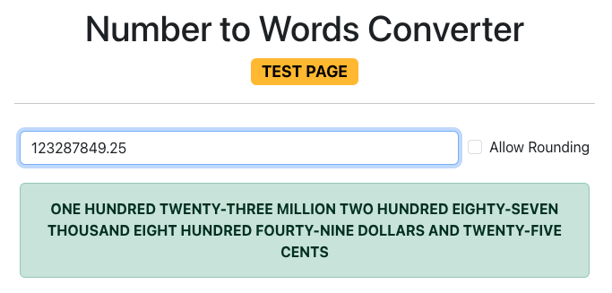

# N2W-Converter: Friendly Guideline

- [N2W-Converter: Friendly Guideline](#n2w-converter-friendly-guideline)
  - [Components Description](#components-description)
  - [Let's Talk About Algorithm](#lets-talk-about-algorithm)
    - [Think of the Algorithm as a Digital Wizard 🧙‍♂️](#think-of-the-algorithm-as-a-digital-wizard-️)
    - [Breaking Down the Number 🧩](#breaking-down-the-number-)
    - [The Summary in a Nutshell](#the-summary-in-a-nutshell)
  - [How to Deploy API with Client](#how-to-deploy-api-with-client)
    - [Prerequisites](#prerequisites)
    - [Using `docker-compose`](#using-docker-compose)
      - [Steps Summary](#steps-summary)
  - [How to Deploy API only](#how-to-deploy-api-only)
    - [Prerequisites](#prerequisites-1)
    - [Method 1: Using Public Docker Image](#method-1-using-public-docker-image)
      - [Steps Summary](#steps-summary-1)
    - [Method 2: Using Local Docker Image](#method-2-using-local-docker-image)
      - [Steps Summary](#steps-summary-2)
    - [Method 3: Running in VS Code](#method-3-running-in-vs-code)
    - [Prerequisites](#prerequisites-2)
      - [Steps Summary](#steps-summary-3)
  - [How to Run Unit Tests](#how-to-run-unit-tests)
    - [Prerequisites](#prerequisites-3)
    - [Steps to Run Unit Tests](#steps-to-run-unit-tests)
      - [Steps Summary](#steps-summary-4)
  - [Test Plan](#test-plan)
    - [Introduction](#introduction)
    - [Test Cases](#test-cases)
  - [**Test Execution**](#test-execution)

---


## Components Description

N2W Converter is a simple .NET Web API that can convert dollar and cents in decimal values into words. There are 3 main impotant components in this project:

| **Component** | **Description** |
|:-------------|:----------------|
| **API**       | Web API project that contains endpoints that accept decimal values, convert them to words, and respond with the results. You can test this API using given `client`, `SwaggerUI` or the `demo.sh` script. |
| **client**   | Very simple client app developed using React, easy enough to get you started. |
| **API.Tests** | Unit tests for the `Convert` function to ensure all scenarios are handled. While not guaranteed to be bug-free, it aims to be nearly so. |
| **demo.sh**   | Interactive shell script to test the API. You can edit the base URL and port number here, and set `AllowRounding` to `True` or `False` (default is `False`). |

---


## Let's Talk About Algorithm

So, here’s the scoop on the algorithm I'm using. It might not be the fanciest or most mind-blowing formula you’ll ever find online (like those that promise to solve world hunger with just a few lines of code), but it’s pretty solve the problem!

### Think of the Algorithm as a Digital Wizard 🧙‍♂️

Imagine you’re a digital wizard trying to turn boring old numbers into magical words. 🧙‍♂️✨ Instead of summoning mystical incantations, we’re using a bit of number-crunching logic that’s more like organizing your sock drawer!

### Breaking Down the Number 🧩

Here’s the secret sauce:

1. **Identify the Stars:** Every decimal number can be splitted into 2 groups. First group, the "dollar" that can contain infinitely large number and second group, the "cent" which could not exceed 2 digits. For dollar part, it consist of three main elements: **Ones**, **Tens**, and **Hundreds** while the cent only contains **Ones** and **Tens**. Those elements can be viewed as below:
   - **Ones** the smallest member (1, 2, 3, etc.).
   - **Tens** are the two-digit pals (20, 30, 40, etc.).
   - **Hundreds** are the big shots (100, 200, 300, etc.).

2. **Divide and Conquer:** Just like slicing a pizza into slices, I split the number into these three parts using some string magic.
   - **String Indexing:** A fancy term for picking out parts of a number like a kid picking out their favorite candy. 🍭

3. **Create Word Objects:** I then turn these parts into words using a bit of digital craftiness.
   - **Ones → "Three", "Seven"**
   - **Tens → "Twenty", "Fifty"**
   - **Hundreds → "One Hundred", "Two Hundred"**
   - **Illions → "Thousands", "Millions", "Billions", "Trillions", "Quadrillions", ...** 
  
     *Firstly "Illions" is a new word I introduce here, you'ren't gonna find elsewhere and secondly, I purposely make it exceed trillions because, let’s be honest, ₿ value might keep going up forever, right! 🚀💰*
     
4. **Combine Words:** Next, I piece everything together into one beautiful, wordy masterpiece. Just like making a sandwich from the ingredients you have.

5. **Handle Special Cases:** Every good recipe has its quirks, like “teens” (10-19) which are their own special club. 🎉

6. **Code It Up:** Finally, I code all this into a neat algorithm that takes a number and turns it into words!

7. **Extra Sauce**: I have optional parameter called `AllowRounding`. Set it to `false` if you don't want to allow more than 2 decimal points or `true` to round it up into just 2 decimal points.

### The Summary in a Nutshell

| **Step**                   | **What’s Happening?**                                                                                                  |
|:--------------------------|:---------------------------------------------------------------------------------------------------------------------|
| **Be a Number Wizard**   | Converting numbers to words might not involve spells, but it does involve breaking things down and putting them back together! |
| **Find the Stars**       | Break down numbers into **Ones**, **Tens**, and **Hundreds** like sorting your LEGO pieces.                          |
| **Slice the Number**     | Use string manipulation like a digital chef to divide the number into components.                                    |
| **Create Word Objects**  | Convert those components into words, sort of like translating numbers into the language of the fairy tales.          |
| **Make a Word Sandwich**  | Combine those words to form the final, magical word representation of the number.                                     |
| **Handle Special Guests** | Deal with those tricky “teen” numbers like a pro party host.                                                           |
| **Write the Code**       | Turn this fun process into code that does the magic for you!                                                            |

So, while my algorithm might not win any awards for elegance, it sure gets the job done in a fun and practical way. 🏆🎉


## How to Deploy API with Client

### Prerequisites
Ensure Docker is installed on your machine to proceed with following method.

### Using `docker-compose`

1. **Clone the Repository**

    ```sh
    git clone https://github.com/programmermelayu/n2w-converter.git
    ```

2. **Navigate to Project Directory**

    Change to the directory where the cloned repository is located:

    ```sh
    cd n2w-converter
    ```

3. **Run Docker-Compose**

    Start the services defined in the `docker-compose.yml` file:

    ```sh
    docker-compose up -d
    ```

    This command will build the necessary Docker image for `API` and `client`, create containers, and start them.

4. **Verify the Deployment**

    - **API:** Open your web browser and navigate to `http://localhost:3030/swagger` to access the Swagger UI for the API.
    - **Client:** Open your web browser and navigate to `http://localhost:3000` to access the client application.

5. **Modify Demo Script**

    Update the port number in `n2w-converter/demo.sh` to match the API port specified in the `docker-compose.yml` file.

    ```sh
    # Line 5: local base_url=http://localhost:3030
    ```

6. **Test the API**

    You can now test the API either using client page at `http://localhost:3000` or from `demo.sh` file by running following command:

    ```sh
    ./demo.sh
    ```
7. **Removing containers**

    ```sh
    cd n2w-converter
    docker-compose down

#### Steps Summary

- **Clone the Repository:** `git clone https://github.com/programmermelayu/n2w-converter.git`
- **Navigate to Project Directory:** `cd n2w-converter`
- **Create `docker-compose.yml` File:** Define services for API and client
- **Run Docker-Compose:** `docker-compose up -d`
- **Verify the Deployment:** 
  - **API:** Navigate to `http://localhost:3030/swagger`
  - **Client:** Navigate to `http://localhost:3000`
- **Modify Demo Script:** Update in `n2w-converter/demo.sh`
    ```sh
    # Line 5: local base_url=http://localhost:3030
    ```
- **Run the Demo Script:** `./demo.sh`
- **Run `docker-compose down` to remove the containers


## How to Deploy API only

### Prerequisites
1. Ensure Docker is installed on your machine to proceed with either method.
2. Ensure you have the [.NET SDK](https://dotnet.microsoft.com/download) installed on your machine.

### Method 1: Using Public Docker Image

1. **Run the Docker Container**

    ```sh
    docker run -p 3004:8080 -d --rm --name n2w-converter-api nasminzain/n2w-converter-api
    ```

2. **Clone the Repository**

    ```sh
    git clone https://github.com/programmermelayu/n2w-converter.git
    ```

3. **Edit the Port Number**

    Update the port number in `n2w-converter/demo.sh` to match the port number specified in Step 1.

    ```sh
    # Line 5: local base_url=localhost:3004
    ```

4. **Run the Demo Script**

    ```sh
    ./demo.sh
    ```

#### Steps Summary

- **Run the Docker Container:** `docker run -p 3004:8080 -d --rm --name n2w-converter-api nasminzain/n2w-converter-api`
- **Clone the Repository:** `git clone https://github.com/programmermelayu/n2w-converter.git`
- **Edit the Port Number:** Update in `n2w-converter/demo.sh`
    ```sh
    # Line 5: local base_url=localhost:3004
    ```
- **Run the Demo Script:** `./demo.sh`


---

### Method 2: Using Local Docker Image

1. **Clone the Repository**

    ```sh
    git clone https://github.com/programmermelayu/n2w-converter.git
    ```

2. **Build the Docker Image**

    Navigate to the `API` directory and run the following command:

    ```sh
    cd n2w-converter/API
    docker build -t n2w-converter-api .
    ```

3. **Run the Docker Container**

    ```sh
    docker run -p 3004:8080 -d --rm --name n2w-converter-api n2w-converter-api
    ```

4. **Edit the Port Number**

    Update the port number in `n2w-converter/demo.sh` to match the port number specified in Step 3.

    ```sh
    # Line 5: local base_url=localhost:3004
    ```

5. **Run the Demo Script**

    ```sh
    ./demo.sh
    ```

#### Steps Summary

- **Clone the Repository:** `git clone https://github.com/programmermelayu/n2w-converter.git`
- **Build the Docker Image:** `cd n2w-converter/API` and `docker build -t n2w-converter-api .`
- **Run the Docker Container:** `docker run -p 3004:8080 -d --rm --name n2w-converter-api n2w-converter-api`
- **Edit the Port Number:** Update in `n2w-converter/demo.sh`
    ```sh
    # Line 5: local base_url=localhost:3004
    ```
- **Run the Demo Script:** `./demo.sh`

    If the Docker container is running successfully, you will be able to connect to the API and start sending requests.

---

### Method 3: Running in VS Code

### Prerequisites
- Ensure you have the [.NET SDK](https://dotnet.microsoft.com/download) installed on your machine.

1. **Clone the Repository**

    Clone the repository to your local machine using the following command:

    ```sh
    git clone https://github.com/programmermelayu/n2w-converter.git
    ```

2. **Open the Project in VS Code**

    Navigate to the project directory and open it in VS Code:

    ```sh
    cd n2w-converter
    code .
    ```

3. **Open the API Project**

    In VS Code, open the `API` directory where the `.csproj` file is located. You can do this by either using the VS Code file explorer or the following command in the integrated terminal:

    ```sh
    cd API
    ```

4. **Restore Dependencies**

    Restore the .NET dependencies required for the project:

    ```sh
    dotnet restore
    ```

5. **Build the Project**

    Build the .NET project to ensure everything is set up correctly:

    ```sh
    dotnet build
    ```

6. **Run the API**

    Start the .NET Web API using the following command:

    ```sh
    dotnet run
    ```

    By default, the API will run on `http://localhost:5xxx`. You can verify the exact URL in the output of the `dotnet run` command.

7. **Test the API with Swagger**

    Open your web browser and navigate to `http://localhost:5xxx/swagger` (or the respective URL based on the `dotnet run` output) to access the Swagger UI for API testing.

8. **Edit the Port Number**

    Update the port number in `n2w-converter/demo.sh` to match the port number specified in Step 6.

    ```sh
    # Line 5: local base_url=http://localhost:5052
    ```

9.  **Run the Demo Script**

    Open a new terminal window or tab and execute the demo script to run the API demo:

    ```sh
    ./demo.sh
    ```

#### Steps Summary

- **Clone the Repository:** `git clone https://github.com/programmermelayu/n2w-converter.git`
- **Open the Project in VS Code:** `cd n2w-converter` and `code .`
- **Open the API Project:** `cd API`
- **Restore Dependencies:** `dotnet restore`
- **Build the Project:** `dotnet build`
- **Run the API:** `dotnet run`
- **Test the API with Swagger:** Navigate to `http://localhost:5052/swagger`
- **Edit the Port Number:** Update in `demo.sh`
    ```sh
    # Line 5: local base_url=http://localhost:5052
    ```
- **Run the Demo Script:** `./demo.sh`


---

## How to Run Unit Tests 

### Prerequisites

- Ensure you have the [.NET SDK](https://dotnet.microsoft.com/download) installed on your machine.
- Make sure `API.Tests` exist in the solution directory

### Steps to Run Unit Tests

1. **Open a Terminal or Command Prompt**

   - On **Windows**, you can use Command Prompt, PowerShell, or the terminal integrated into Visual Studio Code.
   - On **macOS** or **Linux**, open the Terminal application.

2. **Navigate to `API.Tests` Directory**

   Change the directory to the root where the `.sln` file is located, or directly to the directory of the test project.

   ```sh
   cd n2w-converter
   ```

3. **Restore Dependencies**

   Ensure that all necessary packages are installed by running the `dotnet restore` command.

   ```sh
   dotnet restore
   ```

   *Restores the NuGet packages required for the project.*

4. **Build the Solution**

   Compile the code to make sure there are no build errors.

   ```sh
   dotnet build
   ```

   *Builds the project and prepares it for testing.*

5. **Run the Tests**

   Execute the `dotnet test` command to run all the unit tests in the solution or test project.

   ```sh
   dotnet test
   ```

   *Runs all the unit tests and displays the test results in the terminal.*

6. **View the Test Results**

   After running `dotnet test`, you will see the results in the terminal, including which tests passed, failed, or were skipped.

   - **Green**: Tests passed.
   - **Red**: Tests failed.
   - **Yellow**: Tests were skipped.

   *Example output:*
   ```
   Test Run Successful.
   Total tests: 15
   Passed: 15
   Failed: 0
   Skipped: 0
   ```
8. **Generate Test Reports**

   You can generate test reports using the `--logger` option.

   ```sh
   dotnet test --logger "trx;LogFileName=test_results.trx"
   ```

   *Generates a `.trx` file with test results that can be viewed in Visual Studio or other tools.*

#### Steps Summary

- **Open a Terminal or Command Prompt:** Use Command Prompt, PowerShell, or Terminal depending on your OS.
- **Navigate to Your Project Directory:** Change the directory to where the `.sln` file or test project is located.
    ```sh
    cd path/to/your/project
    ```
- **Restore Dependencies:** Install necessary packages.
    ```sh
    dotnet restore
    ```
- **Build the Solution:** Compile the project.
    ```sh
    dotnet build
    ```
- **Run the Tests:** Execute all unit tests.
    ```sh
    dotnet test
    ```
- **View the Test Results:** Check the terminal for test outcomes.
- **Generate Test Reports (Optional):** Create a `.trx` file with test results.
    ```sh
    dotnet test --logger "trx;LogFileName=test_results.trx"
    ```
---

## Test Plan 

### Introduction

This test plan describes the unit tests for the `Converter` class methods. These tests validate various functionalities of the `Converter` class that converts decimal numbers into English words representing monetary values.


### Test Cases

| **Test Cases**                                               | **Inputs**                | **Expected Result**                                                                                                                                                  | **Notes**                                                                                                 |
|-------------------------------------------------------------|---------------------------|----------------------------------------------------------------------------------------------------------------------------------------------------------------------|-----------------------------------------------------------------------------------------------------------|
| Verify conversion of a number in the thousands range.     | `1234.32M`                | `"ONE THOUSAND TWO HUNDRED THIRTY-FOUR DOLLARS AND THIRTY-TWO CENTS"`                                        | Tests handling of thousands and two decimal places.                                                     |
| Verify conversion of a number in the millions range.      | `12345678.75M`            | `"TWELVE MILLION THREE HUNDRED FOURTY-FIVE THOUSAND SIX HUNDRED SEVENTY-EIGHT DOLLARS AND SEVENTY-FIVE CENTS"` | Tests handling of large numbers in the millions range.                                                   |
| Verify conversion of a very large number in the trillions range. | `99999999999999.99M`    | `"NINETY-NINE TRILLION NINE HUNDRED NINETY-NINE BILLION NINE HUNDRED NINETY-NINE MILLION NINE HUNDRED NINETY-NINE THOUSAND NINE HUNDRED NINETY-NINE DOLLARS AND NINETY-NINE CENTS"` | Tests handling of extremely large numbers.                                                                |
| Verify conversion of an even larger number in the trillions range. | `999999999999999.99M`   | `"NINE HUNDRED NINETY-NINE TRILLION NINE HUNDRED NINETY-NINE BILLION NINE HUNDRED NINETY-NINE MILLION NINE HUNDRED NINETY-NINE THOUSAND NINE HUNDRED NINETY-NINE DOLLARS AND NINETY-NINE CENTS"` | Tests handling of the largest number scenario.                                                            |
| Verify conversion of a number with both trillions and smaller dollar amounts. | `900000000000009.99M`   | `"NINE HUNDRED TRILLION NINE DOLLARS AND NINETY-NINE CENTS"`                                                 | Ensures correct conversion for large amounts with minor dollar and cent values.                         |
| Verify conversion of a number just above one dollar.       | `1.99M`                   | `"ONE DOLLAR AND NINETY-NINE CENTS"`                                                                          | Tests conversion for amounts with one dollar and two decimal places.                                      |
| Verify conversion of the value exactly one dollar.        | `1M`                      | `"ONE DOLLAR"`                                                                                              | Ensures that the conversion for exactly one dollar is correct.                                            |
| Verify conversion of a value just above one dollar.       | `1.01M`                   | `"ONE DOLLAR AND ONE CENT"`                                                                                   | Checks the conversion for one dollar and one cent.                                                        |
| Verify conversion of a value just below one dollar.       | `0.99M`                   | `"NINETY-NINE CENTS"`                                                                                         | Ensures conversion for amounts under one dollar.                                                          |
| Verify conversion of a value with only one cent.          | `0.01M`                   | `"ONE CENT"`                                                                                                 | Checks conversion for amounts less than one dollar with only one cent.                                    |
| Verify conversion of a value with ten cents.             | `0.1M`                    | `"TEN CENTS"`                                                                                               | Tests conversion for ten cents.                                                                            |
| Verify conversion of a value with fifteen cents.         | `0.15M`                   | `"FIFTEEN CENTS"`                                                                                           | Tests conversion for fifteen cents.                                                                      |
| Verify that the converter throws an exception for more than two decimal places. | `1.123M`                 | Throws an `Exception` with the message `"INVALID INPUT"`                                                      | Ensures that the converter rejects more than two decimal places without `allowRounding`.                  |
| Verify that the converter correctly rounds values with more than two decimal places when `allowRounding` is enabled. | `1.123M`, `allowRounding: true` | `"ONE DOLLAR AND TWELVE CENTS"`                                                                            | Ensures rounding functionality works with `allowRounding` enabled.                                        |
| Verify that the converter throws an exception for negative values. | `-1M`                    | Throws an `Exception` with the message `"INVALID INPUT"`                                                      | Ensures that the converter rejects negative values.                                                       |

## **Test Execution**

To run these tests, use the following command in your terminal:

```sh
dotnet test
```

This command will execute all the test cases in the `API.Tests` project.

---

By following these instructions, you can set up and run the Number to Words Converter API quickly and efficiently. If you encounter any issues, please email me at nasminzain@gmail.com or programmermelayu@gmail.com whichever you prefer!
